# Order Food
## Problem
Sumaq Burger is a small fast food restaurant. The business owner has another company and he can not control the orders of his food business. The owner needs a system to control the orders of the users and see the activity of his sales.The restaurant needs to control it is user orders to be delivered. Customers communicate by phone and restaurant employees waits for orders, write on paper and send the order.The city is small and money transactions are made in cash.
Therefore the customers place and order and the employee returns a call to confirm their order.

can we use payment methods like Braintree, Stripe, Paypal?
Not because the city is small and not very developed. Cash payment methods are used by 90% of the population, will be added in the future.

What if we receive a lot of orders every minute? you would have many employees answering the phone.
We do not have to worry about scalability at the moment since the business is small and receives on average 12 orders in an hour.Due to the pandemic, sales fell, it is being considered to extend the application in the future.

## ACTUAL CUSTOMER REQUIREMENTS
- The client needs to fill out a form with their orders.
- The restaurant employee receives the order, prepare it and send it
- The business owner needs see a graph of his earnings

### CLIENT SIDE
- form to fill his personal data such as, telephone, address and the order.

### BUSINESS OWNER SIDE
- Dashboard with a graph of his earnings.
 
###  EMPLOYEE SIDE
- Table for receive the orders.

## TECHNOLOGIES
### BACKEND
- Django

### FRONTEND
- Html
- TailwindCss

### DATABASE
- PostgreSQL

### Third party tools
- Chart.js

## DESIGN
- Pencil Project (wireframes)

## METHODLOGY
- Kanban (Trello)

## Wireframes
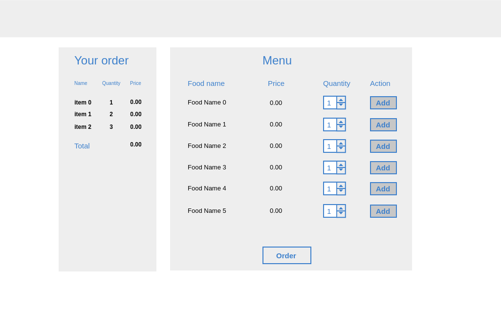
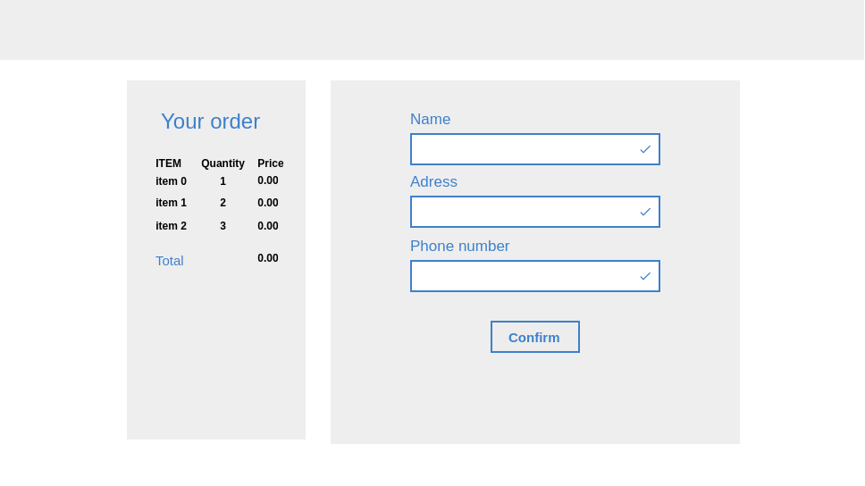
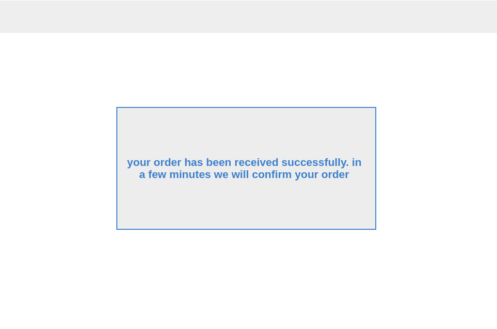
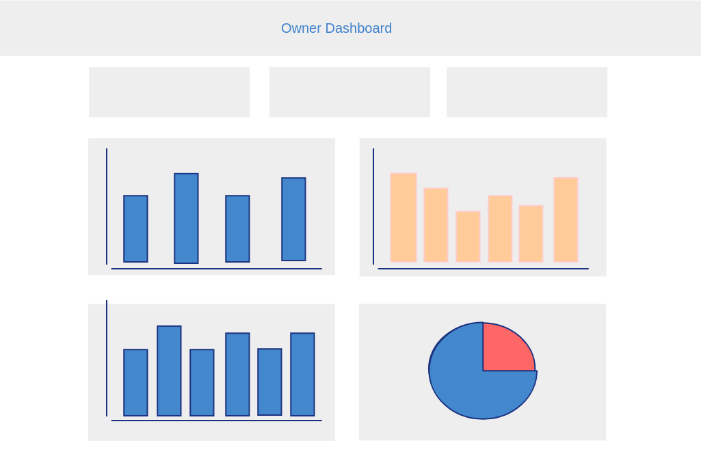
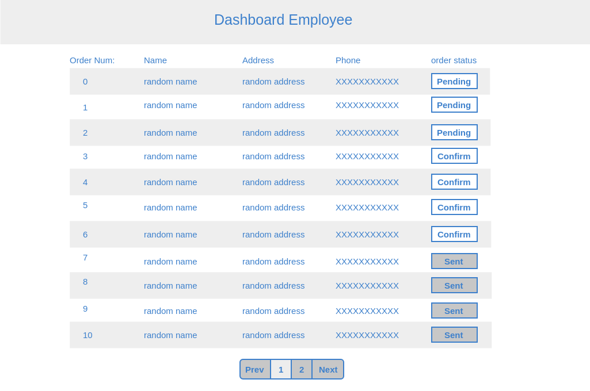

## Screenshots
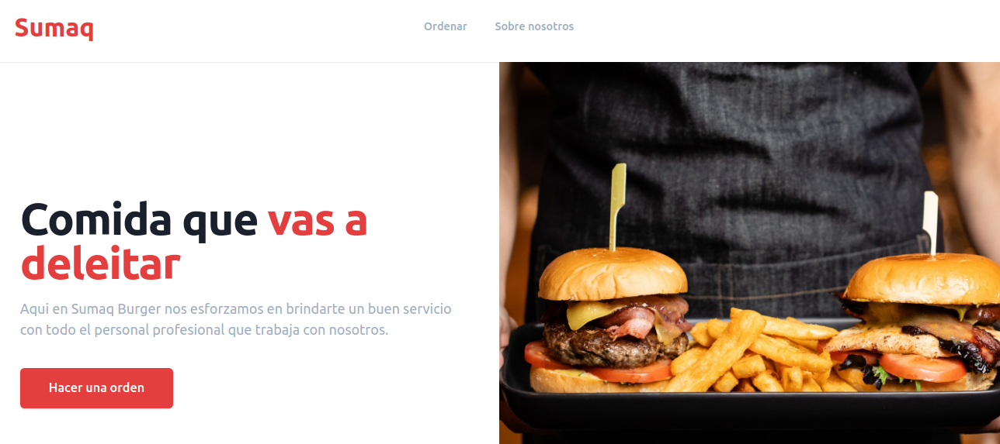
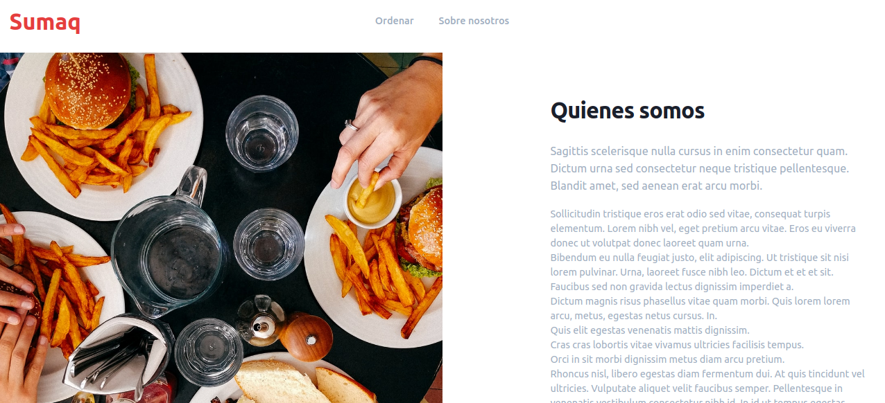
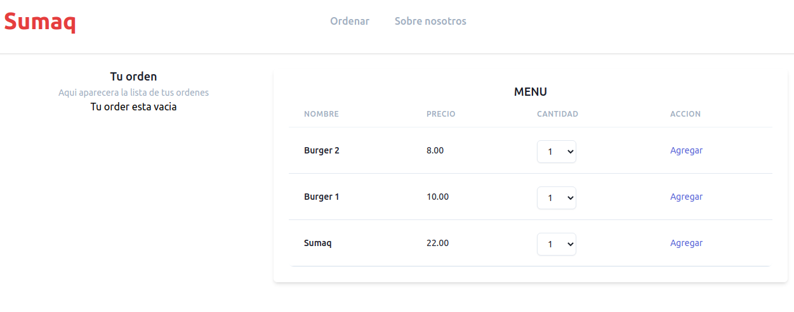
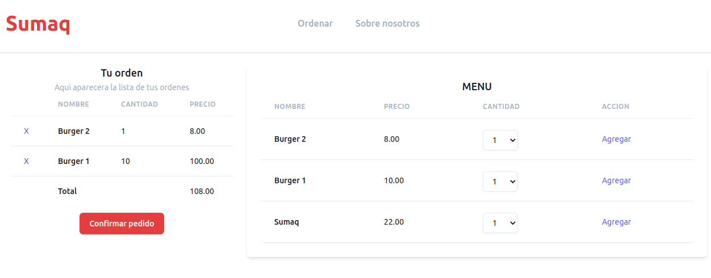
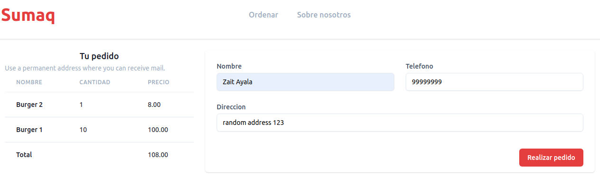
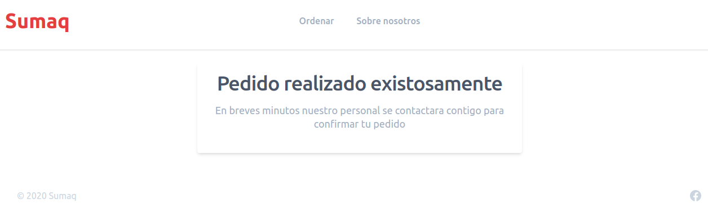
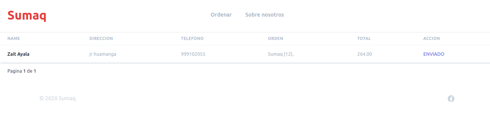
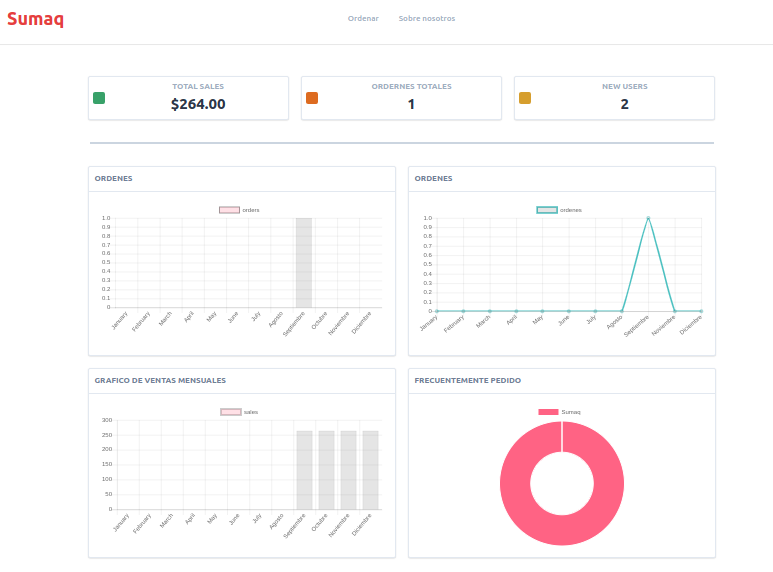

## FUTURE FEATURES
- Update dashboard employee, owner in real time
    - Posibles solutions:
        - ReactJs
        - AsyncViews
        - Django channels

## LOCAL DEV
- clone repository
- create a new virtualenv
- cd server/
- pip install -r requirements.txt
- python manage.py runserver
